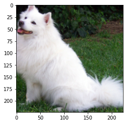
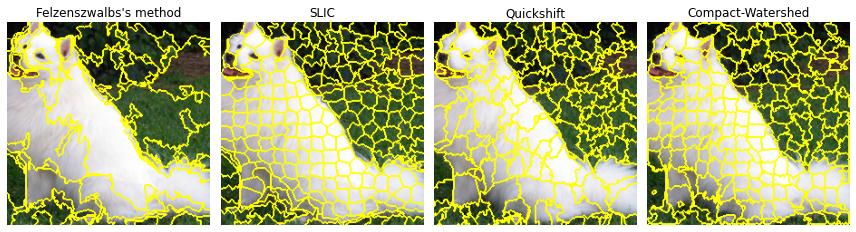
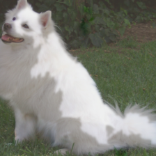

# Local Interpretable Model-Agnostic Explanations (LIME) for Image Classification

Implementation of the paper by [Ribeiro et al. (2016)](https://arxiv.org/abs/1602.04938), presenting LIME as a way to interpret black-box model predictions by approximating local behavior with interpretable models. This notebook focuses on image classification tasks.

## Importing the model (ResNet18)


Let us import pytorch and and check if the GPU is available


```python
import torch

assert torch.cuda.is_available()
device = torch.device("cuda")
print("Using device:", device)
```

    Using device: cuda


We can now load a pretrained version of ResNet18. It is important to put the model on evaluation mode because of the batch normalization layers in ResNet. Otherwise, the model does not use the running mean/std it computed during training and the predictions are junk.


```python
model = torch.hub.load('pytorch/vision:v0.6.0', 'resnet18', pretrained=True)
model.eval();
```

    Downloading: "https://github.com/pytorch/vision/archive/v0.6.0.zip" to /root/.cache/torch/hub/v0.6.0.zip
    Downloading: "https://download.pytorch.org/models/resnet18-5c106cde.pth" to /root/.cache/torch/hub/checkpoints/resnet18-5c106cde.pth


    HBox(children=(FloatProgress(value=0.0, max=46827520.0), HTML(value='')))


    


We can use the *Samoyed* example straight from pytorch's [documentation](https://pytorch.org/hub/pytorch_vision_resnet/). The image is preprocessed and converted to a tensor (with values between -1 and 1).


```python
# Download an example image from the pytorch website
import urllib
url, filename = ("https://github.com/pytorch/hub/raw/master/dog.jpg", "dog.jpg")
try: urllib.URLopener().retrieve(url, filename)
except: urllib.request.urlretrieve(url, filename)

# sample execution (requires torchvision)
from PIL import Image
from torchvision import transforms

input_image = Image.open(filename)

preprocess = transforms.Compose([
    transforms.Resize(256),
    transforms.CenterCrop(224),
    transforms.ToTensor(),
    transforms.Normalize(mean=[0.485, 0.456, 0.406], std=[0.229, 0.224, 0.225]),
])

input_tensor = preprocess(input_image)
```

We can define a function to convert the tensor back to the original image, using the means and standard deviations we specified in the *Normalize()* transform.


```python
import matplotlib.pyplot as plt
import numpy as np

def to_img(tensor):
    # un-normalize the tensor
    mean = np.array([0.485, 0.456, 0.406])
    std = np.array([0.229, 0.224, 0.225])
    img = 255.*(tensor.cpu().permute(1,2,0).numpy()*std.reshape(1,1,3)+ mean.reshape(1,1,3))
    return img.astype(np.uint8)

plt.imshow(to_img(input_tensor));
```





We can now download the 1000 classes id's and labels from ImageNet and check if the model is working properly.


```python
import requests
import json

url = 'https://s3.amazonaws.com/deep-learning-models/image-models/imagenet_class_index.json'
class_idx = json.loads(requests.get(url).text)
```

To evaluate the model on the image, we define a *predict* function that takes a (mini) batch of inputs and outputs the pre-softmax layer. We need to run a *softmax* and an *argmax* function to get the final prediction.


```python
def predict(input_batch):
    """
    input_batch has dim (batch_size, 3, 224, 224)
    """
    input_batch = input_batch.to(device)
    model.eval()
    model.to(device)
    with torch.no_grad():
        output = model(input_batch)

    # Tensor of shape 1000, with confidence scores over Imagenet's 1000 classes
    # The output has unnormalized scores. To get probabilities, you can run a softmax on it.

    return output
```


```python
output = predict(input_tensor.unsqueeze(0))
probabilities = torch.nn.functional.softmax(output, dim=1)
probas, predictions = probabilities.max(dim = 1) 

predicted_class = class_idx[str(int(predictions))]
print('Predicted class: {}\nProbability {:.2f}'.format(predicted_class[1], float(probas)))
```

    Predicted class: Samoyed
    Probability 0.88


Seems like the model is working properly. Let us get on with the implementation of the LIME algorithm then.

## Sparse Linear Explanations using LIME


The first step is to divide the image into larger chunks called *superpixels*, to use them as interpretable features for our local model. See [Schallner et al.](https://arxiv.org/abs/1910.07856) for a comparison of image segmentation techniques for LIME and [Scikit Image's documentation](https://scikit-image.org/docs/stable/auto_examples/segmentation/plot_segmentations.html) for implementations.

The following cell compares the Felzenszwalb, SLIC, Quickshift and Compact-Watershed methods for superpixel aggregation:


```python
from skimage.segmentation import felzenszwalb, slic, quickshift, watershed
from skimage.segmentation import mark_boundaries
from skimage.util import img_as_float
from skimage.color import rgb2gray
from skimage.filters import sobel

img = to_img(input_tensor)

segments_fz = felzenszwalb(img, scale=100, sigma=0.5, min_size=50)
segments_slic = slic(img, n_segments=250, compactness=10, sigma=1)
segments_quick = quickshift(img, kernel_size=3, max_dist=6, ratio=0.5)
gradient = sobel(rgb2gray(img))
segments_watershed = watershed(gradient, markers=250, compactness=0.001)

print(f"Felzenszwalb number of segments: {len(np.unique(segments_fz))}")
print(f"SLIC number of segments: {len(np.unique(segments_slic))}")
print(f"Quickshift number of segments: {len(np.unique(segments_quick))}")

fig, ax = plt.subplots(1, 4, figsize=(12, 6), sharex=True, sharey=True)

ax[0].imshow(mark_boundaries(img, segments_fz))
ax[0].set_title("Felzenszwalbs's method")
ax[1].imshow(mark_boundaries(img, segments_slic))
ax[1].set_title('SLIC')
ax[2].imshow(mark_boundaries(img, segments_quick))
ax[2].set_title('Quickshift')
ax[3].imshow(mark_boundaries(img, segments_watershed))
ax[3].set_title('Compact-Watershed')

for a in ax.ravel():
    a.set_axis_off()

plt.tight_layout()
plt.show()
```

    Felzenszwalb number of segments: 93
    SLIC number of segments: 231
    Quickshift number of segments: 197





Let us use *Felzenszwalbs* for this example. Furthermore, we define a function *turn_off_segments* that takes an image tensor as input and returns the image with grayed out pixels for the corresponding segments.


```python
segments = np.copy(segments_fz)
segments = torch.tensor(segments).to(device)
```


```python
from functools import reduce

def turn_off_segments(image, segments, segment_ids, replace_value = 0.):
    """
    image: tensor of shape (3, 224, 224)
    segment_ids is a list containing the ids of the segments we want to mask
    returns an image tensor with grayed out pixels for the corresponding segment id's
    """
    segments_ext = segments.unsqueeze(0).repeat(3,1,1).to(device)
    dummy = torch.ones_like(image, device = device)
    condition = reduce(lambda a,b: (a)|(b), [segments_ext == dummy*id_ for id_ in segment_ids])
    return torch.where(condition, torch.tensor(replace_value, device = device), image.to(device))
```

As in the original paper, we use an exponential kernel to weight the sampled data instances according to their distance to the original data instance. The distance function is the squared distance for images.


```python
def exp_kernel(x, z, distance, sigma):
    return torch.exp(-distance(x,z)**2 / sigma**2)

def L2_distance(x,z):
    return torch.dist(x.to(device),z.to(device),p=2)
```

We implement the LIME algorithm as in the original paper (sparse linear model), using *Least Angle Regression* to select $K$ features and then fit a linear model on those features.

The influence of each instance's prediction is weighted by the kernel function in the loss:
$$\mathcal{L}(f,g,\pi_x) = \sum_{z,z'\in\mathcal{Z}}\pi_x(z)(f(z)-g(z'))^2$$
Therefore, we pass $\sqrt{\pi_x(z)}f(z)$ as the true labels and $\sqrt{\pi_x(z)z}$ as training data. Indeed, by linearity of $g$: $g\Big(\sqrt{\pi_x(z)z}\Big) = \sqrt{\pi_x(z)}g(z)$

After training the local model, we print the adjusted $R^2$ coefficient to determine how well the interpretable model approximates the black box model.


```python
from sklearn import linear_model

def train_local_model(x, N, K, segments):
    """
    x is the input tensor image

    returns the coefficients of the sparse linear model g
    """
    _, predicted_idx = predict(x.unsqueeze(0)).max(dim = 1)

    n_segments = len(torch.unique(segments))

    instances_g = [] # contains the z_prime
    instances_f = [] # contains the z
    kernel = [] # contains the weigths given by the kernel function

    for _ in range(N):
        #sample instances around x′ by drawing nonzero elements of x′ uniformly at random 
        #where the number of such draws is also uniformly sampled
        segment_ids = np.unique(np.random.choice(np.arange(n_segments) , size = n_segments)).tolist()
        z = turn_off_segments(x, segments, segment_ids) #input image with masked pixels
        z_prime = torch.ones(n_segments, device = device) # z_prime is the interpretable version: a tensor of ones with for each segment that is present
        z_prime[segment_ids] = 0.

        instances_g.append(z_prime.unsqueeze(0)) # shape (1, n_segments)
        instances_f.append(z.unsqueeze(0))
        kernel.append(exp_kernel(x, z, L2_distance, sigma = 0.75*n_segments)) # kernel width used in the original implementation

    instances_g = torch.cat(instances_g, dim = 0) # shape (N, n_segments) N acts as a batch_size
    instances_f = torch.cat(instances_f, dim = 0)
    weights = torch.sqrt(torch.tensor(kernel, device = device)).unsqueeze(1)

    f = predict(instances_f) #(N, 1000)
    f = f[:, predicted_idx]

    y = (weights*f).cpu().numpy()
    X = (weights*instances_g).cpu().numpy()

    lars = linear_model.Lars(n_nonzero_coefs = K, fit_intercept = True)
    lars.fit(X,y)

    indices = np.where(lars.coef_ != 0.)[0].tolist()
    new_X = X[:, indices]
    lin_model = linear_model.LinearRegression().fit(new_X, y)

    R2 = lin_model.score(new_X,y)
    adj_R2 = 1 - (1-R2)*(N-1)/(N-K-1)
    print('Adjusted R squared: {:.2f}'.format(adj_R2))

    return indices, lin_model.coef_
```


```python
indices, coefs = train_local_model(input_tensor, N = 100, K = 10, segments = segments)
```

    Adjusted R squared: 1.00


We can display the superpixels with non-zero coefficients on top of the original image to observe which features the local model deems important in the prediction.


```python
from skimage.filters import gaussian

def explain_prediction(indices, input_tensor, segments):
    n_segments = len(torch.unique(segments))
    discard = [i for i in range(n_segments) if i not in indices]
    overlay = turn_off_segments(input_tensor, segments, discard)
    overlay = 225.*gaussian(to_img(overlay), 1.5, multichannel = True) # blur the edges to get a prettier result
    overlay = overlay.astype(np.uint8)
    overlay = Image.fromarray(overlay)
    orig_im = Image.fromarray(to_img(input_tensor))
    enhanced_features = Image.blend(overlay, orig_im, 0.5)
    display(enhanced_features)
```


```python
explain_prediction(indices, input_tensor, segments)
```





We can see the local model mostly picks up on the fur as well as the ears of the Samoyed. It also selects some patch of leaves and grass in the background (set the gaussian filter parameter to 0 to see it more clearly), which suggests the black box model could wrongly consider that grass/leaves is a distinctive features of Samoyeds. This might be due to an overwhelming presence of training images containing grass, with the Samoyed label. We can further analyze this dependency by looking at the learnt coefficients of the features. The patch of grass could very well have a negative coefficient if the training data only contains Samoyed on the sidewalk e.g.

## References
- Ribeiro, Marco Tulio, Sameer Singh, and Carlos Guestrin. "Why should I trust you?: Explaining the predictions of any classifier." Proceedings of the 22nd ACM SIGKDD international conference on knowledge discovery and data mining. ACM (2016)
- Schallner et al., "Effect of Superpixel Aggregation on
Explanations in LIME – A Case Study with
Biological Data" arXiv:1910.07856 (2019)
