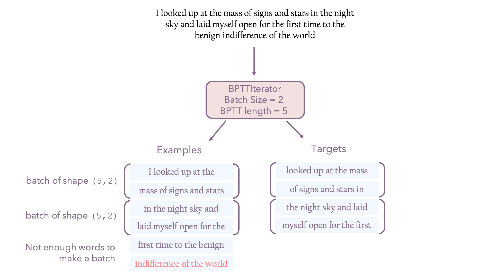
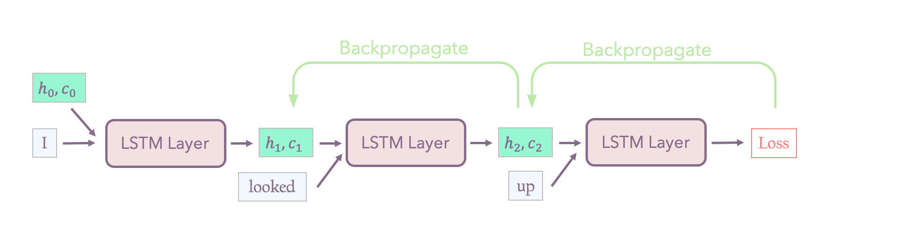
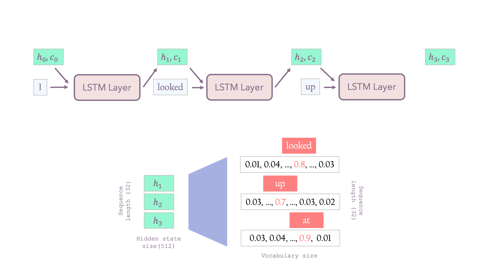
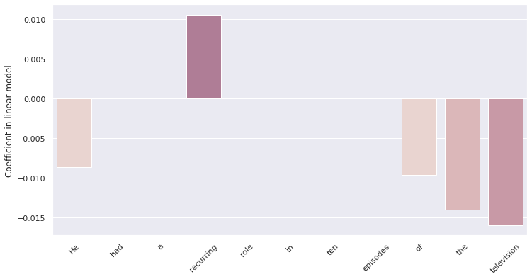

# LIME for Language Modeling

Implementation of the paper by Ribeiro et al., "Why should I trust you?: Explaining the predictions of any classifier" (2016) ([link](https://arxiv.org/abs/1602.04938)), presenting Local Interpretable Model-agnostic Explanations (LIME) as a way to interpret black-box model predictions by approximating local behavior with interpretable models. This notebook focuses on language modeling tasks.

## The LSTM Language Model

We will first implement a LSTM Language Model using the [WikiText2](https://www.salesforce.com/products/einstein/ai-research/the-wikitext-dependency-language-modeling-dataset/) language modeling dataset.  The dataset consists in a list of word level tokens and comes with some of the basic preprocessing done for us, such as tokenization and rare word filtering (using the `<unk>` token). In addition, `torchtext` replaces new lines with `<eos>` tokens. We can assume that all word types in the test set also appear at least once in the training set.

We first need to declare a `Field` to tell `torchtext` how to handle the data - e.g. which tokenizing function to use. We then create training, validation and test datasets objects from the `WikiText2` dataset, using the field we declared, and then build our `Vocab` object.

For a more detailed introduction to `torchtext`, please refer to this [blog post](http://anie.me/On-Torchtext/).


```python
# imports
import torch
from torch import nn
import torch.nn.functional as F
import torchtext

#check if cuda is available
assert torch.cuda.is_available(), 'cuda is not available'
device = torch.device("cuda")

print("Using device:", device)
```


```python
text_field = torchtext.data.Field() # create a Field object used to define a datatype
datasets = torchtext.datasets.WikiText2.splits(root='.', text_field=text_field) # create dataset objects for splits of the WikiText-2 dataset
train_dataset, validation_dataset, test_dataset = datasets 
text_field.build_vocab(train_dataset) # construct the Vocab object that represents the set of possible values for this field.
vocab = text_field.vocab
vocab_size = len(vocab)

train_text = train_dataset.examples[0].text # yields a list of tokens (strings)
validation_text = validation_dataset.examples[0].text

print(validation_text[:30])
```

    downloading wikitext-2-v1.zip


    wikitext-2-v1.zip: 100%|██████████| 4.48M/4.48M [00:00<00:00, 6.25MB/s]


    extracting
    ['<eos>', '=', 'Homarus', 'gammarus', '=', '<eos>', '<eos>', 'Homarus', 'gammarus', ',', 'known', 'as', 'the', 'European', 'lobster', 'or', 'common', 'lobster', ',', 'is', 'a', 'species', 'of', '<unk>', 'lobster', 'from', 'the', 'eastern', 'Atlantic', 'Ocean']


For recurrent language modeling, sentences are concatenated together so that one sentence starts right after the other, and an unfinished sentence will be continued in the next batch. The `BPTTIterator` (Backpropagation Through Time) form the `torchtext` library provides "*contiguous streams of examples together with targets that are one timestep further forward*".



In the example above: `I` is responsible for predicting `looked`, `looked` for predicting `up`, etc...

In general, $k_1$ words are passed through the model and we backpropage through $k_2$ words. In the following figure, the model passes 3 words and backpropagates through 2. 



If we use several LSTM layers, for each word, the state of the previous layer is used as input for the following one. A state is a tuple $(h,c)$ that consists in a hidden state and a context vector, each with shape `(number of layers, batch size, hidden size)`. The initial state (state that is used for the first word) is set to zero (for both the hidden state and the context vector).

In our case, the BPPTIterator returns contiguous streams of examples, therefore, for each sequence in the batch, $k_1 =$ sequence length words are passed through the model and we backpropagate through $k_2 = $ sequence length words (i.e. $k_1 = k_2$). Moreover, the losses are added for each sequence in the batch. For further explanations on backpropagation through time, please refer to *Jurafsky and Martin, "Speech and Language Processing", chapter 9 ([link](https://web.stanford.edu/~jurafsky/slp3/))*.

To properly deal with this input format, the last state of the LSTM from a batch is fed as the first state of the next batch.  While saving a state across different batches, one should call `.detach()` on the state tensors before the next batch to tell PyTorch not to backpropagate gradients through the state into the batch we have already finished (which will cause a runtime error).

We will use the following architecture and hyperparameters:
* an embedding layer with dimension 128
* 3 LSTM layers with 512 units
* dropout of 0.5 after each LSTM layer
* 1 linear layer to project down from 512 (LSTM output) to 128
* 1 linear layer to project from 128 to the vocabulary size (sharing weights with the embedding layer)

For each sequence, one word passes through the model after the other, using the previous words' hidden state as input to the LSTM layers. Each word's hidden state is then projected up to the vocabulary size, to predict a probability distribution for the next word:



The perplexity is then computed using the following formula:
$$ perplexity = 2^{H(p)} = 2^{-\sum_{i=1}^N p(x_i) \log_2 (q(x_i))}$$
Where:
* $N$ is the total number of words in the corpora
* $X$ is a random variable representing the word
* $p(X = x_i)$ is the true distribution of $X$
* $q(X = x_i)$ is the proposed probability distribution

If we assume that all words are drawn uniformly from the corpora of $N$ words, $p(x_i) = \frac{1}{N} \forall i=1,...,N$ and:
$$perplexity = 2^{\frac{1}{N}\sum_{i=1}^N \log_2 (q(x_i))} = e^{\frac{1}{N}\sum_{i=1}^N \log (q(x_i))}$$


```python
import tqdm
import numpy as np
import os

class LSTMNetwork(nn.Module):
    def __init__(self):
        super().__init__()

        self.lstm = nn.LSTM(128, 512, num_layers = 3, dropout = 0.5)
        self.dropout = nn.Dropout(0.5)
        # instead of projecting directly from the last LSTM output to 
        # the vocabulary size for softmax, project down to a smaller size first
        self.linear1 = nn.Linear(512,128)
        self.linear2 = nn.Linear(128,vocab_size)

    def forward(self, x, state):
        """
        x - a tensor of int64 inputs with shape (seq_len, batch)
        state - a tuple of two tensors with shape (num_layers, batch, hidden_size)
                representing the hidden state and cell state of the LSTM.
        returns a tuple with two elements:
          - a tensor of log probabilities with shape (seq_len, batch, vocab_size)
          - a state tuple returned by applying the LSTM.
        """
        seq_len, batch_size = x.shape
        x = x.to(device)
        x = F.embedding(x, self.linear2.weight) 
        # we use the same weights for the embedding layer and the pre-softmax layer (dimension 128)
        output, state = self.lstm(x, state) 
        # output has dim (seq_len, batch_size, hidden_size)
        # and represents the hidden state at each timestep in the sequence 
        # state = (h, c) have dim (num_layers, batch_size, hidden_size) 
        # and represents the hidden state at t = seq_len
        output = self.dropout(output)
        output = self.linear1(output)
        output = self.linear2(output) # output dim (seq_len, batch_size, vocab_size)
        
        return output.view(seq_len*batch_size, vocab_size), state

class LSTMModel:
    """
    A class that wraps LSTMNetwork to handle training and evaluation.
    """
    def __init__(self):
        self.network = LSTMNetwork().to(device)

    def train(self):
        batch_size = 64
        bptt_len = 32
        train_iterator = torchtext.data.BPTTIterator(train_dataset, batch_size=batch_size, 
                                                     bptt_len=bptt_len, device=device)
        model_file = os.path.join(os.getcwd(), 'best_model_lstm.pt') # where we are going to save the model
        
        optimizer = torch.optim.Adam(self.network.parameters(), lr = 1e-3)
        # at each epoch, the learning rate is decreased by 5%
        scheduler = torch.optim.lr_scheduler.LambdaLR(optimizer, lr_lambda= lambda epoch: 0.95 ** epoch)
    
        min_perplexity = float(np.inf)

        # The initial states passed into the LSTM are set to zero 
        # and have dimension (number of layers, batch size, hidden size)
        state = (torch.zeros(3,batch_size,512).to(device), torch.zeros(3,batch_size,512).to(device))

        for epoch in range(20):
            print('Epoch', epoch)
            
            # We iterate over train_iterator with a for loop to get batches.
            # Each batch object has a .text and .target attribute with
            # token id tensors for the input and output respectively.

            for batch in tqdm.notebook.tqdm(train_iterator, leave = False):
                self.network.train() 
                # put the model back in training mode (it is put in eval mode during the perplexity computation)
                optimizer.zero_grad()

                text, target = batch.text, batch.target
                text = text.to(device)
                target = target.to(device) # dimension: (bptt_len, batch_size)
                target = target.flatten()

                pred, state = self.network(text, state)
                h,c = state

                state = (h.detach(), c.detach()) # to avoid backpropagating to a batch we already trained on
                loss = F.cross_entropy(pred, target)
                loss.backward()
                optimizer.step()

            perplexity = self.dataset_perplexity(validation_dataset)
            print('Perplexity on validation dataset: {:.2f}'.format(perplexity))

            if perplexity < min_perplexity: # saving model if perplexity has decreased (prevents overfitting)

                min_perplexity = perplexity
                torch.save(self.network.state_dict(), model_file) # save the best model so far
            
            scheduler.step() # decrease the learning step

        self.network.load_state_dict(torch.load(model_file)) # load the best model after training

    def next_word_probabilities(self, text_prefix):
        """
        Return a list of probabilities for each word in the vocabulary.
        """
        prefix_token_tensor = torch.tensor([vocab.stoi[t] for t in text_prefix], device=device).view(-1, 1) 
        # dimension: (seq_len, batch)
        self.network.eval()
        state = (torch.zeros(3,1,512).to(device), torch.zeros(3,1,512).to(device)) 
        # dimension: (number of layers, batch size, hidden size)
        probas, _ = self.network(prefix_token_tensor, state) 
        # dimension (len(prefix), vocab_size)
        # we only keep the hidden state at t = len(prefix_token_tensor)
        probas = F.softmax(probas[-1, :].flatten(), dim = 0).detach()
        return probas

    def dataset_perplexity(self, torchtext_dataset):
        """
        Return perplexity as a float.
        """

        with torch.no_grad():
            seq_len = 32
            batch_size=64
            iterator = torchtext.data.BPTTIterator(torchtext_dataset, batch_size=batch_size, bptt_len=seq_len, device=device)
            state = (torch.zeros(3,batch_size,512).to(device), torch.zeros(3,batch_size,512).to(device)) # (number of layers, batch size, hidden size)

            self.network.eval() # put the model in evaluation mode

            log_probabilities = []
            for entry in tqdm.notebook.tqdm(iterator):
                text, target = entry.text, entry.target
                text = text.to(device)
                target = target.to(device)
                
                probas, state = self.network(text, state) # dimension (seq_len, vocab_size, batch_size)
                target = target.cpu().numpy().flatten() # dimension (seq_len*batch_size)
                probas = F.log_softmax(probas, dim=1).cpu().numpy() 
                # dimension (seq_len*batch_size, vocab_size)
                # taking softmax and then log is computationally unstable
                # pytorch combines the two operations for us
                probas = probas[np.arange(len(probas)), target].flatten()
                log_probabilities += probas.tolist()
            return np.exp(-np.mean(log_probabilities))

```

One way to check if our implementation or `dataset_perplexity()` or `next_word_probabilities()` are correct is to make sure we get the same perplexity if we compute it with one or the other. To compute the perplexity using `next_word_probabilities()`, we loop over the validation text and get the true word's probability using all the words up to the current iteration index as prefix.


```python
lstm_model = LSTMModel()

# To train the model from scratch, execute: lstm_model.train()

amodel_file = 'best_model_lstm.pt'
lstm_model.network.load_state_dict(torch.load(model_file)) # load pretrained model

print('LSTM validation perplexity: {:.2f}'.format(lstm_model.dataset_perplexity(validation_dataset)))
print('LSTM test set perplexity: {:.2f}'.format(lstm_model.dataset_perplexity(test_dataset)))
```


    HBox(children=(FloatProgress(value=0.0, max=107.0), HTML(value='')))


    
    LSTM validation perplexity: 130.59


We achieved around 130 perplexity on WikiText2's validation set and 123 on the test set, which is not too bad for a LSTM language model. 

### See also
* Merity et. al, "Pointer Sentinel Mixture Models", (2016) ([link](https://arxiv.org/pdf/1609.07843.pdf)) for an introduction to the WikiText2 dataset.
* Merity et. al, "Regularizing and Optimizing LSTM Language Models" (2017) arXiv:1708.02182 ([link](https://arxiv.org/pdf/1708.02182.pdf)) for tips on LSTM training.

We can now generate text from a language model by conditioning on the previous words and sampling a new word according to the predicted distribution over the entire vocabulary.


```python
import random

def generate_text(model, n=10, prefix=['<eos>']):
    for _ in range(n):
        probs = model.next_word_probabilities(prefix)
        word = random.choices(vocab.itos, probs)[0]
        prefix.append(word)
    return ' '.join(prefix)
```


```python
generate_text(lstm_model)
```


    '<eos> Long International Society account is a special pilot field allow'


There are many strategies to get better-sounding samples (e.g. only sampling from the top-k words or sharpening the distribution with a temperature).  

See this [paper](https://arxiv.org/pdf/1904.09751.pdf) to read more about sampling from language models: Holtzman et al., "The Curious Case of Neural Text Degeneration", 2020.


## LIME Implementation


```python
def exp_kernel(x, z, distance, sigma):
    return torch.exp(-distance(x,z)**2 / sigma**2)

def cosine_similarity(x,z, model = lstm_model):
    tensor_x = torch.tensor([vocab.stoi[t] for t in x], device=device)
    tensor_z = torch.tensor([vocab.stoi[t] for t in z], device=device)

    embed_x = F.embedding(tensor_x, model.network.linear2.weight) #(seq_len, 128)
    embed_z = F.embedding(tensor_z, model.network.linear2.weight)
    return F.cosine_similarity(embed_x, embed_z, dim = 1).sum()/len(x) # (seq_len, 128) -> (seq_len)
```


```python
from sklearn import linear_model

def train_local_model(sample, N, K, model = lstm_model):
    """
    x is the prefix list as input to the lstm model

    returns the coefficients of the sparse linear model g
    """
    prefix = sample[:-1]
    predicted_idx = int(model.next_word_probabilities(prefix).max(dim = 0).indices)

    n_words = len(prefix)

    instances_g = [] # contains the z_prime
    instances_f = [] # contains the z
    kernel = [] # contains the weigths given by the kernel function

    for _ in range(N):
        #sample instances around x′ by drawing nonzero elements of x′ uniformly at random 
        #where the number of such draws is also uniformly sampled
        word_ids = np.unique(np.random.choice(np.arange(n_words) , size = n_words)).tolist()
        z = [prefix[i] if (i in word_ids) else '<pad>' for i in range(len(prefix))] #input prefix with masked words
        z_prime = torch.ones(n_words) # interpretable input: tensor of ones for each word that is present
        z_prime[word_ids] = 0.

        instances_g.append(z_prime.unsqueeze(0)) # shape (1, n_segments)

        #pad sequence
        instances_f.append(z)
        kernel.append(exp_kernel(prefix, z, cosine_similarity, sigma = 0.75*n_words)) # kernel width used in the original implementation

    instances_g = torch.cat(instances_g, dim = 0) # shape (N, n_segments) N acts as a batch_size
    weights = torch.sqrt(torch.tensor(kernel)).unsqueeze(1)

    f = []
    for instance in instances_f:
        probas = model.next_word_probabilities(instance)[predicted_idx]
        probas = float(probas)
        f.append(probas)
    f = np.array(f).reshape(-1,1)

    y = (weights*f).numpy()
    X = (weights*instances_g).numpy()

    lars = linear_model.Lars(n_nonzero_coefs = K, fit_intercept = True)
    lars.fit(X,y)

    indices = np.where(lars.coef_ != 0.)[0].tolist()
    new_X = X[:, indices]
    lin_model = linear_model.LinearRegression().fit(new_X, y)

    R2 = lin_model.score(new_X,y)
    adj_R2 = 1 - (1-R2)*(N-1)/(N-K-1)
    print('Adjusted R squared: {:.2f}'.format(adj_R2))
    return indices, lin_model.coef_
```


```python
indices, coef = train_local_model(sample, N = 150, K = 5)
```

    Adjusted R squared: 0.34


```python
prefix = sample[:-1]

#include the zero coefficients of the words that were not selected by the LARS algorithm
extended_coef = np.zeros(len(prefix))
coef = coef.flatten()
j = 0
for i in indices:
    extended_coef[i] = coef[j]
    j+=1
```


```python
import seaborn as sns
import matplotlib.pyplot as plt
sns.set()

plt.figure(figsize=(12,6))
sns.barplot(x = prefix, y = extended_coef, palette = sns.cubehelix_palette(8))
plt.xticks(rotation='45')
plt.ylabel('Coefficient in linear model');

print('Original test sentence: "{}"'.format(' '.join(sample)))
proba, predicted_idx = lstm_model.next_word_probabilities(prefix).max(dim = 0)
prediction = vocab.itos[int(predicted_idx)]
print('Words and coefficients contributing to the predicted word: "{}" with {:.2f}% probability'.format(prediction, 100*proba))

```

    Original test sentence: "He had a recurring role in ten episodes of the television series"
    Words and coefficients contributing to the predicted word: "series" with 7.98% probability





Here, we can see the main limitation of LIME: **modeling local behavior with a linear model when the model is highly non-linear**. The low R squared score can tell us this is not a sound approximation.
